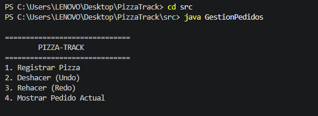
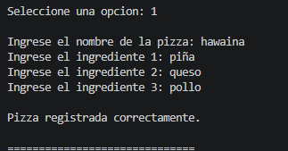
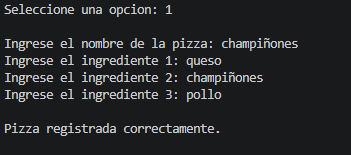
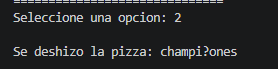

# Pizza-Track

## Sistema de Gestión de Pedidos de una Pizzería

Pizza-Track es una aplicación desarrollada en **Java** que simula un sistema básico de gestión de pedidos de una pizzería mediante la consola.

El proyecto implementa el funcionamiento de las operaciones **Undo (Deshacer)** y **Redo (Rehacer)** utilizando **dos pilas manuales**, construidas desde cero mediante **listas ligadas y nodos**.

---
##  Objetivo del proyecto

Desarrollar una aplicación en Java que permita registrar pedidos de pizzas y controlar las operaciones de deshacer y rehacer utilizando estructuras de datos tipo pila.

El proyecto tiene como finalidad aplicar conceptos de:

- Programación orientada a objetos.
- Arreglos.
- Listas ligadas.
- Nodos.
- Pilas.
- Métodos `push()`, `pop()`, `peek()` e `isEmpty()`.
- Manejo de entradas por consola.
- Control de versiones con Git y GitHub.

---

##  Funcionalidades

El sistema cuenta con las siguientes opciones:

### 1. Registrar Pizza

Permite ingresar:

- Nombre de la pizza.
- Ingrediente 1.
- Ingrediente 2.
- Ingrediente 3.

Cada pizza utiliza un arreglo fijo de **3 ingredientes**.

El pedido se almacena en la pila principal.

### 2. Deshacer (Undo)

Permite eliminar el último pedido registrado.

La pizza retirada de la pila principal se almacena temporalmente en la pila secundaria.

### 3. Rehacer (Redo)

Permite recuperar la última pizza que fue deshecha.

La pizza pasa nuevamente de la pila secundaria a la pila principal.

### 4. Mostrar Pedido Actual

Permite consultar la pizza que se encuentra en el tope de la pila principal utilizando el método `peek()`.

### 0. Salir

Permite finalizar la ejecución del programa.

---

##  Estructura del proyecto

El proyecto está organizado de la siguiente manera:

```text
PizzaTrack/
│
├── src/
│   ├── Pizza.java
│   ├── Nodo.java
│   ├── Pila.java
│   └── GestionPedidos.java
│
└── README.md
## 📸 Evidencias del funcionamiento

### Menú principal


### Registrar Pizza



### Deshacer Pizza - Undo


### Rehacer Pizza - Redo
capturas/redo.png
